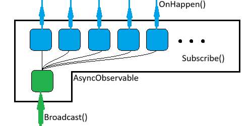

# AiurObserver

[](https://gitlab.aiursoft.com/aiursoft/AiurObserver/-/blob/master/LICENSE)
[](https://gitlab.aiursoft.com/aiursoft/AiurObserver/-/pipelines)
[](https://gitlab.aiursoft.com/aiursoft/AiurObserver/-/pipelines)
[](https://www.nuget.org/packages/Aiursoft.AiurObserver/)
[](https://gitlab.aiursoft.com/aiursoft/AiurObserver/-/commits/master?ref_type=heads)

AiurObserver is a powerful C# development tool that allows you to construct an object that can be observed asynchronously. It comes with a set of operators that make it easy for you to manipulate and process data streams.

Call `Subscribe()` to subscribe to an observable. Call `BroadcastAsync()` to broadcast a message to all subscribers. That's it!



## How to install

```bash
dotnet add package Aiursoft.AiurObserver
```

## Key Features

- **Asynchronous Observation**: AiurObserver provides an AsyncObservable interface. You can create an object that can be observed asynchronously and subscribe to it.
- **Subscription Operation**: When observing, you need to pass in a Consumer. The consumer is essentially a function that defines what the consumer should do when the source of the subscription pushes.
- **Data Stream Manipulation**: It provides a set of operators such as Filter, Map, Throttle, Repeat, Sample, Aggregate, etc., that can easily manipulate data streams.
- **Subscription Cancellation**: If you don't want to consume anymore, you can simply cancel the subscription.

## Use Cases

AiurObserver is particularly suitable for the following scenarios:

- **Running Commands**: Occasionally it will output two lines, but it's uncertain when it will write. I need to subscribe to its output.
- **WebSocket Remote**: Occasionally something might spit in, but it's uncertain when it will spit in. When it does spit in, I need to take action.
- **A game of chess**: Players will take actions to change its state. It's uncertain when the chessboard will change; but when it really changes, I also need to execute custom code.
- **Event Generators**: It's uncertain when an event will occur, but once an event occurs, I need to perform certain operations.

## How to use

It's very simple. You can create a class extends AsyncObservable<T> and then you can subscribe to it and broadcast messages to it.

`T` is the type of the message you want to broadcast.

If you no longer need to subscribe to the observable, you can call `UnRegister` method to unsubscribe.

Full example:

```csharp
var totalMessages = 0;
var asyncObservable = new AsyncObservable<int>();
var subscription = asyncObservable.Subscribe(_ =>
{
    totalMessages++;
    return Task.CompletedTask;
});
for (var i = 0; i < 10; i++)
{
    await asyncObservable.BroadcastAsync(2333);
}

Console.WriteLine(totalMessages); // 10
subscription.Unsubscribe(); // No longer receive messages.
```

## Why it's not IEnumerable or Stream

While AiurObserver might seem similar to IEnumerable or Stream, it's not a substitute for either.

- **IEnumerable**: IEnumerable is a pull-based model. The consumer requests the next item. With AiurObserver, it's a push-based model. The producer pushes the data when it's available. This makes AiurObserver more suitable for real-time data and event-driven scenarios.

- **Stream**: Stream is designed for byte data and is often used for reading and writing to a file or network stream. AiurObserver, on the other hand, is designed for object data and is more suitable for scenarios where data is produced and consumed asynchronously.

## Read document

Please click [here](./docs/HowToUse.md) to learn how to use it.

## How to contribute

There are many ways to contribute to the project: logging bugs, submitting pull requests, reporting issues, and creating suggestions.

Even if you with push rights on the repository, you should create a personal fork and create feature branches there when you need them. This keeps the main repository clean and your workflow cruft out of sight.

We're also interested in your feedback on the future of this project. You can submit a suggestion or feature request through the issue tracker. To make this process more effective, we're asking that these include more information to help define them more clearly.
